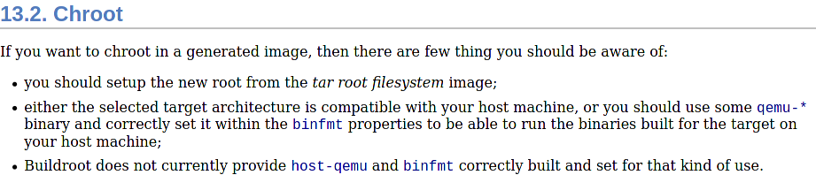

# Buildroot notes for BASC seminar

- [Presentation link](presentation/pres.pdf)
- [Annotated presentation link](presentation/pres-ann.pdf)

## About buildroot

Buildroot is a set of [Makefile](https://en.wikipedia.org/wiki/Make_(software)) + [KConfig](https://www.kernel.org/doc/html/latest/kbuild/kconfig-language.html) scripts that tries to create an easy way for creating root images.

The main consumers of buildroot are enterprises creating Linux based embedded systems, think of:

- IoT
- Automated factory control
- Point of sale devices
- Car media units

Why buildroot:

- Each buildroot is a 100% custom Linux "mini-distro"
- Buildroot images can be less than 100MB or even 10MB
- Complete customization of target architecture and build flags
- Multiple compiler / libc / system layout choices
- Updated every 3 months
- Easily extendable

~20 architectures are supported:

- ARC (LE & BE)
- ARM (LE & BE)
- AArch64 (LE & BE)
- csky
- i386
- m68k
- Microblaze AXI
- Microblaze non-AXI
- MIPS (LE & BE)
- MIPS64 (LE & BE)
- nds32
- Nios II
- PowerPC
- PowerPC64 (LE & BE)
- RISCV
- SuperH
- SPARC
- x86_64
- Xtensa

The basic flow that buildroot supports is:

- Creating a configuration file
- Starting the build
- Directly flashing the built image on devices

Beyond the curtain what buildroot does for us is:

- Building a cross compiler (so we can use our powerful build machine)
- Resolving dependencies
- Compiling from source for our target platform the packages
- Assembling an image

## Prerequisites

### Ubuntu 20.04

```sh
sudo apt-get update
sudo apt-get install -y \
  curl tar \
  make \
  gcc g++ \
  libncurses-dev libssl-dev \
  qemu-user-static \
  qemu-system-arm
```

## Obtaining

```sh
curl -L https://buildroot.org/downloads/buildroot-2020.08.1.tar.gz | tar -xzf -
```

## Commands

- `make list-defconfigs` show available config templates
- `make <defconfig>` set the current config to a template
- `make savedefconfig` save the current configuration in cleaned up form to a file named `defconfig`
- `make menuconfig` open configuration
- `make` build the project
- `make distclean` cleanup buildroot build directory
- `make help` show available options

## Creating our own ARM cross-compiler

- Cleanup the environment with `make distclean`
- Run `cp ../scripts/gef-python.sh ./gef-python.sh && chmod +x *.sh`
- Run `make defconfig`
- Run `make menuconfig`
- Target options ->
  - Target Architecture = ARM (little endian)
  - Target Architecture Variant = cortex-A7
  - Floating point strategy = VFPv4-D16
- Build options ->
  - [x] Enable compiler cache
  - [x] build packages with debugging symbols
    - gcc debug level = debug level 3
  - [ ] strip target binaries
  - gcc optimization level = optimize for debugging
- Toolchain ->
  - C library = glibc
  - [x] Enable C++ support
  - [x] Build cross gdb for the host
  - [x] TUI support
  - Python support = Python3
- System configuration ->
  - Custom scripts to run before creating filesystem images = ./gef-python.sh
- Filesystem images ->
  - [ ] tar the root filesystem
- Host utilities ->
  - host python3
  - ssl
- Save
- Run `make source`
- Run `make sdk` and go grab a coffee
- Version `2020.08.1` will by default build you a `GCC 9.3` custom toolchain
- You'll find the package inside `output/images/arm-buildroot-linux-gnueabihf_sdk-buildroot.tar.gz`

To use it:

- Extract it somewhere
- Open the folder you extracted inside a terminal
- Run `relocate-sdk.sh` with `./relocate-sdk.sh`
- Run these commands:

```sh
export PATH="${PATH}:${PWD}/bin"
```

Try to build `hello-arm` with `arm-buildroot-linux-gnueabihf-gcc hello_arm.c -o hello-arm`

```sh
> file hello-arm
hello-arm: ELF 32-bit LSB executable, ARM, EABI5 version 1 (SYSV), dynamically linked, interpreter /lib/ld-linux-armhf.so.3, for GNU/Linux 5.7.0, not stripped
```

## Creating our own ARM buildroot

- Cleanup the environment with `make distclean`
- Run `cp ../scripts/gef-python.sh ./gef-python.sh && chmod +x *.sh`
- Run `make defconfig`
- Run `make menuconfig`
- Target options ->
  - Target Architecture = ARM (little endian)
  - Target Architecture Variant = cortex-A7
  - Floating point strategy = VFPv4-D16
- Build options ->
  - [x] Enable compiler cache
  - [x] build packages with debugging symbols
    - gcc debug level = debug level 3
  - [ ] strip target binaries
  - gcc optimization level = optimize for debugging
- Toolchain ->
  - C library = glibc
  - [x] Enable C++ support
  - [x] Build cross gdb for the host
  - [x] TUI support
  - Python support = Python3
- System configuration ->
  - Custom scripts to run before creating filesystem images = ./gef-python.sh
- Target packages ->
  - Debugging, profiling and benchmark ->
    - [x] gdb
    - [x] full debugger
    - [x] gdbserver
    - [x] TUI support
- Filesystem images ->
  - [x] tar the root filesystem
- Host utilities ->
  - host python3
  - ssl
- Save
- Run `make source` to download sources
- Run `make` and go grab a coffee
- You will our rootfs in `output/images/rootfs.tar`

### Usage of the rootfs



#### Docker

```sh
sudo docker import output/images/rootfs.tar basc-buildroot
sudo docker run --rm -it \
  --volume "$(which qemu-arm-static):/bin/qemu-arm-static" \
  --volume "${PWD}/:/host" \
  --entrypoint /bin/qemu-arm-static \
  --workdir "/host" \
  basc-buildroot \
  /bin/sh
```

#### Systemd-nspawn (like chroot)

```sh
mkdir -p basc-rootfs
tar -xf output/images/rootfs.tar -C basc-rootfs
cp -f "$(which qemu-arm-static)" basc-rootfs/bin/qemu-arm-static
sudo systemd-nspawn --register=no -D basc-rootfs /bin/qemu-arm-static /bin/sh
```

## Creating a bootable ARM image for binary analysis

- Cleanup the environment with `make distclean`
- Run `cp ../kconfigs/virtio.kconfig ./virtio.kconfig`
- Run `cp ../scripts/gef-python.sh ./gef-python.sh && chmod +x *.sh`
- Run `make defconfig`
- Run `make menuconfig`
- Target options ->
  - Target Architecture = ARM (little endian)
  - Target Architecture Variant = cortex-A7
  - Floating point strategy = VFPv4-D16
- Build options ->
  - [x] Enable compiler cache
  - [x] build packages with debugging symbols
    - gcc debug level = debug level 3
  - [ ] strip target binaries
  - gcc optimization level = optimize for debugging
- Toolchain ->
  - C library = glibc
  - [x] Enable C++ support
  - [x] Build cross gdb for the host
  - [x] TUI support
  - Python support = Python3
- System configuration ->
  - System hostname = BASC2020
  - System banner = Welcome to BASC2020 Buildroot
  - Root password = BASC2020
  - Network interface to configure through DHCP = eth0
  - Custom scripts to run before creating filesystem images = ./gef-python.sh
- Kernel ->
  - [x] Linux Kernel ->
    - Kernel configuration = Use the architecture default configuration
    - Additional configuration fragment files = virtio.kconfig
- Target packages ->
  - Debugging, profiling and benchmark ->
    - [x] gdb
    - [x] full debugger
    - [x] gdbserver
    - [x] TUI support
    - [x] ltrace
    - [x] strace
    - [x] valgrind
  - Networking applications ->
    - [x] openssh
    - [ ] client
    - [x] key utilities
- Filesystem images ->
  - [x] ext2/3/4 root filesystem
    - exact size = 128M
  - [ ] tar the root filesystem
- Host utilities ->
  - host python3
  - ssl
- Save
- Run `make source` to download sources
- Run `make` and go grab a coffee

```sh
qemu-system-arm \
  -machine virt \
  -cpu cortex-a7 \
  -smp 4 -m 4096 \
  -kernel output/images/zImage \
  -device virtio-blk-device,drive=rootfs \
  -drive file=output/images/rootfs.ext2,if=none,format=raw,id=rootfs \
  -append "console=ttyAMA0,115200 rootwait root=/dev/vda" \
  -netdev user,id=user0,hostfwd=tcp::2222-:22,hostfwd=tcp::1234-:1234 \
  -device virtio-net-device,netdev=user0 \
  -serial stdio \
  -display none
```

To SSH inside:

```sh
ssh \
  -o UserKnownHostsFile=/dev/null -o StrictHostKeyChecking=no \
  -p 2222 \
  root@localhost
```

To share the target filesystem:

```sh
mkdir -p guest-os-ssh
sshfs root@localhost:/ ./guest-os-ssh \
  -f \
  -o port=2222 \
  -o reconnect \
  -o UserKnownHostsFile=/dev/null -o StrictHostKeyChecking=no
```

## Customizing our images

### At build time

#### Overlay

- Create a directory `my-overlay`
- Add inside `.config`

```sh
BR2_ROOTFS_OVERLAY=my-overlay
```

- Insert the files inside `my-overlay`
- Rebuild using `make`
- The rootfs will contain also the overlay

_Multiple overlays can be specified by separating them with spaces_

#### Build script

- Add inside `.config`

```sh
BR2_ROOTFS_POST_BUILD_SCRIPT=my-script.sh
```

Create `my-script.sh` with arbitrary commands, inside the script there are some variables that can be used:

- `BR2_CONFIG` path of `.config`
- `HOST_DIR` path to `output/host`
- `STAGING_DIR` path to `output/staging`
- `TARGET_DIR` path to `output/target`
- `BUILD_DIR` path to `output/build`
- `BINARIES_DIR` path to `output/images`
- `BASE_DIR` path to `output`

_Multiple scripts can be specified by separating them with spaces_

### After build

#### Rebuilding using buildroot

- Add your files inside `output/target`
- Rebuild using `make`

__Your files might be rewritten / deleted__

#### Do it yourself

- Unpack your rootfs (with `tar -xzf` for instance)
- Add the files
- Repack your rootfs (with `tar -cf` for instance)

## Why there's no compiler / libraries inside buildroot?

Citing the manual:

- Buildroot mostly targets small or very small target hardware with limited resource onboard (CPU, ram, mass-storage), for which compiling on the target does not make much sense
- Buildroot aims at easing the cross-compilation, making native compilation on the target unnecessary
- Since there is no compiler available on the target, it does not make sense to waste space with headers or static libraries

## More info

See the [official manual](https://buildroot.org/downloads/manual/manual.html#_chroot)
